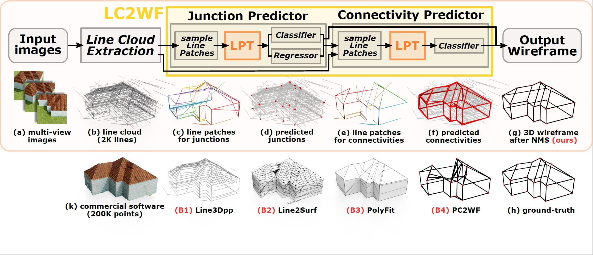

# Learning to Construct 3D Building Wireframes from 3D Line Clouds

<p>

</p>

This is a demo code for our paper "*LC2WF:Learning to Construct 3D Building Wireframes from 3D Line Clouds*", accepted to BMVC 2022, by [Yicheng Luo](https://www.researchgate.net/search.Search.html?ev=nav_search), [Jing Ren](https://ren-jing.com/),  [Xuefei Zhe](https://www.semanticscholar.org/author/Xuefei-Zhe/9621748), [Di Kang](https://scholar.google.com/citations?user=2ztThPwAAAAJ), [Yajing Xu](https://www.researchgate.net/scientific-contributions/Yajing-Xu-2157266562), [Peter Wonka](http://peterwonka.net/), and [Linchao Bao](http://linchaobao.github.io/).

In this work, we propose the first network to process line clouds for building **wireframe** abstraction.
The network takes a line cloud as input , i.e., a nonstructural and unordered set of 3D line segments extracted from multi-view images, and outputs a 3D wireframe of the underlying building, which consists of a sparse set of 3D junctions connected by line segments. 
We observe that a **line patch**, i.e., a group of neighboring line segments, encodes sufficient contour information to predict the existence and even the 3D position of a potential junction, as well as the likelihood of connectivity between two query junctions.
We therefore introduce a two-layer **Line-Patch Transformer** to extract junctions and connectivities from sampled line patches to form a 3D building wireframe model. 
We also introduce a synthetic dataset of multi-view images with ground-truth 3D wireframe.


You can find more details at: [[paper]](https://arxiv.org/abs/2208.11948) | [[dataset and models]](###pretrained-models-and-data) | [[suppl.]]()


## Requirements

* torch   1.8.0
* torchvision 0.9.0
* cuda: 10.0
* python 3.8.8


## Quick Start

### Pretrained Models And Data

|                  | url                                                          |
| :--------------: | ------------------------------------------------------------ |
| pretrained-model | [[Google Drive]] / [[BaiduYun]](https://pan.baidu.com/s/1QwSpN5o9wLnhHcrr1H6IZg)(code:engt) |
|     dataset      | [[Google Drive]](https://drive.google.com/file/d/1vkAwroo5W8VKAUF8LoO7TguaSAAj6Ts_/view?usp=share_link) / [[BaiduYun]](https://pan.baidu.com/s/1kniIVDjgyLIACVze2g4aow )(code:p9kb) |
|    mvs-image     | [[Google Drive]] / [[BaiduYun]](https://pan.baidu.com/s/1Ac0HpVGoYZyKfEzLKlVZoQ )(code:tdnf) |


### Evaluation

1. Clone repository

```
git clone https://github.com/Luo1Cheng/LC2WF.git 
```


2. Download line cloud data and pre-trained model.


3. Unzip files

```
unzip LC2wf_data.zip
unzip pretrained.zip
```


4. Your directory will be like

|----LC2WF_data

|&ensp;&ensp;&ensp;&ensp;|----house

|&ensp;&ensp;&ensp;&ensp;|----LineCloud_0130_P123

|&ensp;&ensp;&ensp;&ensp;|----test.txt

|&ensp;&ensp;&ensp;&ensp;|----train.txt

|----pretrained

|&ensp;&ensp;&ensp;&ensp;|----junction.pth

|&ensp;&ensp;&ensp;&ensp;|----edge.pth

|...


5. To evaluate the model:

```shell
python train.py --yamlName evalJunc
python trainClassify.py --yamlName evalWireframe
cd eval_results
python ours_eval.py
```


6. The predicted wireframe obj files are in **./eval_results/finalOutOBJ**. You can open them with MeshLab


## Train from Scratch

1. Clone repository
`
git clone https://github.com/Luo1Cheng/LC2WF.git 
`


2. Download line cloud data from [[Google Drive]]() or [[Baidu Disk]](https://pan.baidu.com/s/1kniIVDjgyLIACVze2g4aow )(code:p9kb)

   

3. Unzip the files.
`
unzip LC2wf_data.zip
`


4. Train the **junction prediction** model first
`
python train.py --yamlName train
`


5. Change the `load_model` in `config/genPredJunc.yaml` to your `junction_best.pth`, which will be saved in `log/***/saved_models` folder.


6. Generate the predicted junctions of the training and test dataset
`
python train.py --yamlName genPredJunc
`


7. Train the **connectivity prediction** model
`
python trainClassify.py
`


8. The best model will be saved in `log/***/saved_models` folder.


## Comments
### References & Baselines
   1. We use *Line3D++* for line cloud extraction: [[paper]]() | [[code]]()
   2. "***PolyFit**: Polygonal Surface Reconstruction from Point Clouds*", Liangliang Nan and Peter Wonka, ECCV2017. [[project page]](https://3d.bk.tudelft.nl/liangliang/publications/2017/polyfit/polyfit.html)
   3. "***PC2WF**: 3D Wireframe Reconstruction from Raw Point Clouds*", Yujia Liu, Stefano D'Aronco, Konrad, Schindler, Jan Dirk Wegner, ICLR2021. [[paper]]() | [[code]](https://github.com/YujiaLiu76/PC2WF)
   4. Line2Surf
   5. Our dataset is adapted from the paper ["Intuitive and Efficient Roof Modeling for Reconstruction and Synthesis"](https://github.com/llorz/SGA21_roofOptimization/blob/main/README.md)

### Acknowledgements


### License

### Citation
If you use this code/dataset for your research, please cite our paper:

```
@article{luo2022LC2WF,
  author = {},
  title = {},
  journal = {},
  volume = {},
  number = {},
  pages = {},
  year = {},
  publisher = {}
}
```
